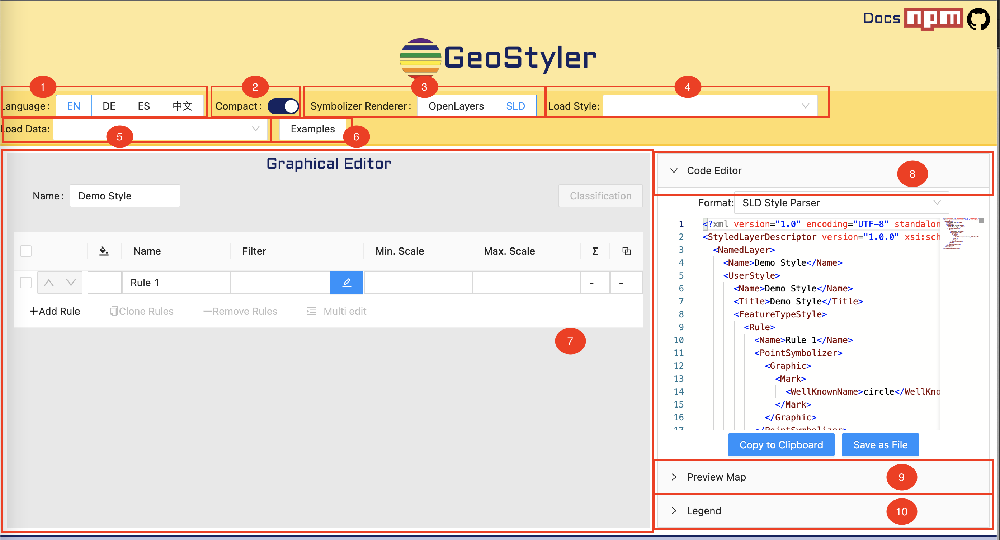
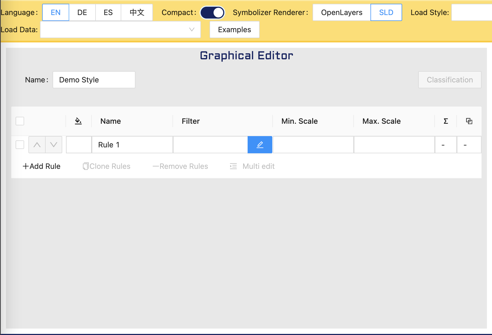
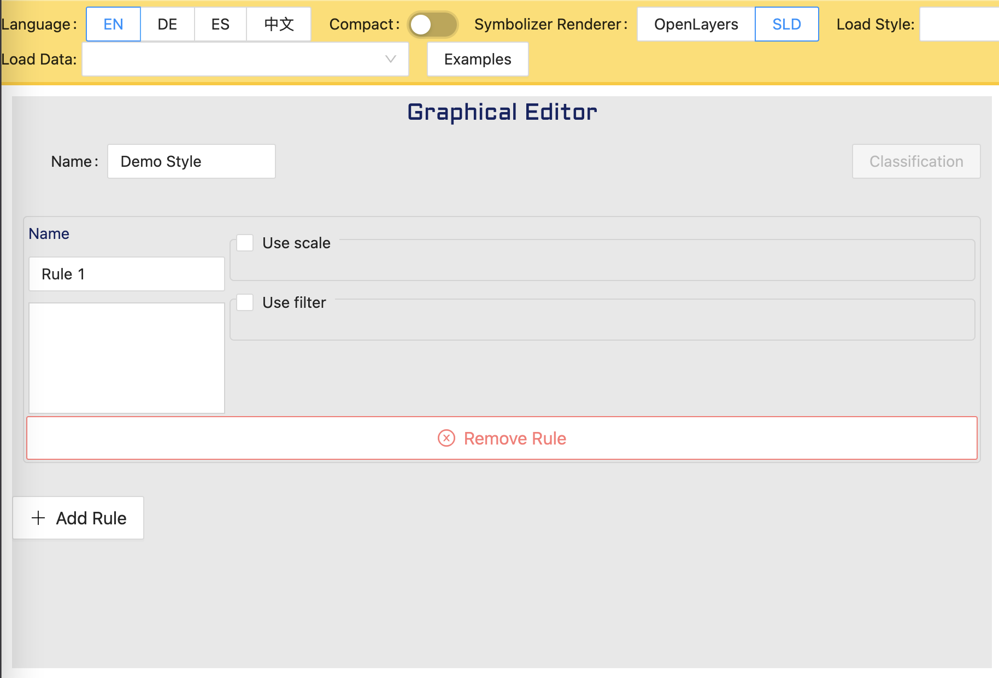
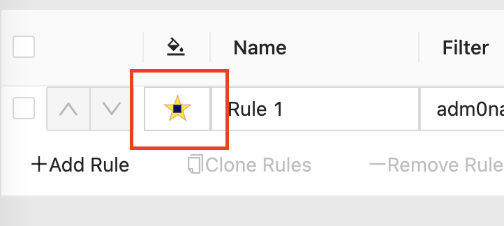

# 🖥️ Demo

All written functions can be tested on the [GeoStyler Demo](https://geostyler.github.io/geostyler-demo/). Also checkout the [geostyler-demo repo](https://github.com/geostyler/geostyler-demo) for the same.

# 🎨 Getting familiar with UI

[Geostyler Demo](https://geostyler.github.io/geostyler-demo/) is a very easy to use, interactive web app which allows users to start testing capabilities of the [GeoStyler library](https://github.com/geostyler/geostyler) without installing it.

There are various components to it as follows 

## 1. Language

[Geostyler](https://geostyler.org/) demo UI can be translated in 5 different languages 

- EN - English
- DE - German
- ES - Spanish
- 中文 - Mandarin
- FR - French

## 2. Compact

Toggling this changes the UI for `Graphical Editor` 7️⃣ into 2 different modes. Please note that from functionalities stand point it will not make any difference. 

Here are both modes

### Compact mode

### Expanded mode

## 3. Symbolizer Renderer

Currently, [Geostyler](https://geostyler.org/) supports `Openlayers` and `SLD` rendering of symbols. Changing this setting will reflect the way symbols are rendered in the `Graphical Editor`

## 4. Load Style

This allows users to import existing `SLD` created using Geoserver, QGIS, etc in the application. 

Once loaded, users can make changes if required or visualize it as it is. 